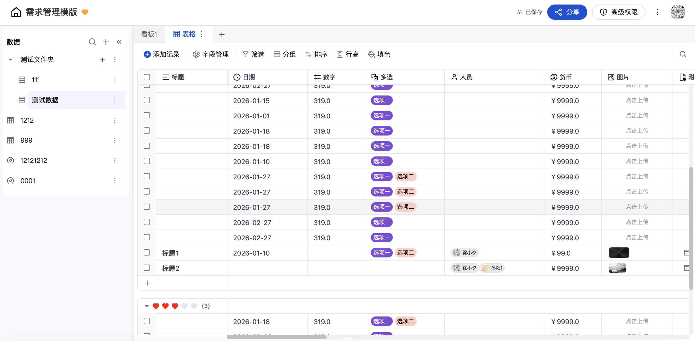

<div align="center">
  <h1>🚀 PxCharts-Vue</h1>
    
  <p>基于 Vue3 + TypeScript 的企业级多维表格 & 低代码表单设计器</p>

[](https://github.com/MrXujiang/pxcharts-vue/stargazers)
[](https://github.com/MrXujiang/pxcharts-vue/network)
[](https://github.com/MrXujiang/pxcharts-vue/issues)
[](https://github.com/MrXujiang/pxcharts-vue/blob/main/LICENSE)

[在线体验](https://pxcharts.turntip.cn) | [使用文档](#-快速开始) | [技术架构](#-技术架构) | [开源矩阵](#-开源矩阵)
</div>

---

## 📖 项目介绍

**PxCharts-Vue** 是一款面向企业级应用的**多维表格管理系统**和**低代码表单设计器**，采用 Vue3 + TypeScript 技术栈构建。项目致力于提供类似 Airtable、Notion 的强大表格能力，同时集成可视化表单设计、数据看板、富文本编辑等丰富功能，帮助企业快速搭建数据管理和协作平台。

### ✨ 核心特性

- 🎯 **多维表格** - 灵活的数据视图切换（表格视图、看板视图、日历视图）
- 🎨 **低代码表单设计器** - 拖拽式表单构建，支持丰富的表单组件和自定义配置
- 📊 **数据可视化** - 集成 ECharts 图表库，支持多种图表类型和自定义配置
- 📝 **富文本编辑器** - 基于 Tiptap 的强大编辑能力，支持图片、链接、文本样式等
- 🎭 **模板市场** - 内置丰富的行业模板，快速启动项目
- 👥 **团队协作** - 支持多团队管理、成员邀请、权限控制
- 🎪 **水印编辑器** - 自定义水印样式，保护数据安全
- 📁 **文件上传** - 完善的文件管理功能
- 🌓 **响应式设计** - 适配各种屏幕尺寸，提供优质的移动端体验

---

## 🎯 功能矩阵

### 核心功能模块

| 功能模块 | 描述 | 技术实现 |
|---------|------|---------|
| 多维表格 | 类 Airtable 的表格系统，支持多种视图模式 | Vue3 Grid Layout + Sortable.js |
| 表单设计器 | 可视化拖拽式表单构建工具 | 自研组件拖拽系统 |
| 数据看板 | 支持看板视图、拖拽排序、状态管理 | Sortable.js + Pinia 状态管理 |
| 图表组件 | 丰富的数据可视化图表 | ECharts 6.0 深度集成 |
| 富文本编辑器 | 功能完善的内容编辑器 | Tiptap + Vue3 |
| 模板系统 | 行业模板库和自定义模板 | 模板引擎 + 动态组件 |
| 团队协作 | 多团队、多项目管理 | Pinia + Axios |
| 用户系统 | 登录注册、权限管理 | JWT Token + 路由守卫 |

### 技术亮点

- ✅ **TypeScript 全面覆盖** - 完整的类型定义，提升开发体验和代码质量
- ✅ **组件化架构** - 高度解耦的组件设计，易于维护和扩展
- ✅ **状态管理优化** - Pinia 现代化状态管理方案
- ✅ **性能优化** - 虚拟滚动、懒加载、代码分割
- ✅ **工程化实践** - ESLint + Prettier + TypeScript 严格代码规范
- ✅ **UI 组件库** - 基于 TDesign Vue Next 企业级组件库
- ✅ **后端技术栈** - GO + PG + Redis + Websock

---

## 🏗️ 技术架构

### 系统架构图

```
┌─────────────────────────────────────────────────────────┐
│                     用户界面层 (UI Layer)                 │
├─────────────────────────────────────────────────────────┤
│  登录注册  │  工作台  │  表格编辑  │  表单设计器  │  看板  │
└─────────────────────────────────────────────────────────┘
                              ↓
┌─────────────────────────────────────────────────────────┐
│                   组件层 (Component Layer)                │
├─────────────────────────────────────────────────────────┤
│  表格组件  │  表单组件  │  图表组件  │  编辑器  │  通用组件  │
└─────────────────────────────────────────────────────────┘
                              ↓
┌─────────────────────────────────────────────────────────┐
│                 业务逻辑层 (Business Logic)               │
├─────────────────────────────────────────────────────────┤
│  状态管理(Pinia) │  路由管理  │  API 服务  │  工具函数   │
└─────────────────────────────────────────────────────────┘
                              ↓
┌─────────────────────────────────────────────────────────┐
│                   数据层 (Data Layer)                     │
├─────────────────────────────────────────────────────────┤
│      HTTP 请求(Axios)  │  本地存储  │  数据缓存         │
└─────────────────────────────────────────────────────────┘
```

### 核心技术实现

#### 1. 多维表格系统

**技术方案**：
- 基于 `vue3-grid-layout-next` 实现灵活的网格布局
- 使用 `sortablejs` 实现拖拽排序功能
- 虚拟滚动优化大数据量渲染性能

**关键代码结构**：
```
src/components/DataTable/
├── GridView.vue          # 网格视图
├── KanbanView.vue        # 看板视图
├── CalendarView.vue      # 日历视图
└── TableConfig.vue       # 表格配置
```

#### 2. 表单设计器

**技术方案**：
- 自研拖拽引擎，支持组件拖拽、排序、嵌套
- 配置化表单渲染，支持动态表单验证
- JSON Schema 驱动的表单配置

**实现特点**：
- 左侧组件面板 - 组件分类、搜索、预览
- 中间画布区域 - 实时预览、拖拽编辑
- 右侧属性配置 - 动态表单、样式配置、事件绑定

#### 3. 数据可视化

**技术方案**：
- 深度集成 ECharts 6.0，封装图表组件
- 支持图表主题定制、响应式布局
- 提供图表二次编辑能力

**支持图表类型**：
- 折线图、柱状图、饼图、散点图
- 雷达图、仪表盘、漏斗图
- 地图、关系图、树图等高级图表

#### 4. 富文本编辑器

**技术方案**：
- 基于 Tiptap 构建，扩展自定义节点
- 支持图片上传、链接插入、文本格式化
- Markdown 快捷键支持

---

## 💻 技术栈

### 前端核心

| 技术 | 版本 | 说明 |
|------|------|------|
| Vue 3 | ^3.5.18 | 渐进式 JavaScript 框架 |
| TypeScript | ~5.8.0 | JavaScript 的超集，提供类型检查 |
| Vite | ^7.0.6 | 下一代前端构建工具 |
| Vue Router | ^4.5.1 | Vue.js 官方路由管理器 |
| Pinia | ^3.0.3 | Vue 3 状态管理库 |

### UI 与组件库

| 技术 | 版本 | 说明 |
|------|------|------|
| TDesign Vue Next | ^1.16.1 | 企业级 UI 组件库 |
| ECharts | ^6.0.0 | 数据可视化图表库 |
| Tiptap | ^3.10.7 | 富文本编辑器框架 |
| Lucide Vue Next | ^0.548.0 | 精美的图标库 |

### 功能增强

| 技术 | 版本 | 说明 |
|------|------|------|
| Axios | ^1.11.0 | HTTP 请求库 |
| Sortable.js | ^1.15.6 | 拖拽排序库 |
| Vue3 Grid Layout Next | ^1.0.7 | 网格布局组件 |
| Day.js | ^1.11.19 | 轻量级日期处理库 |
| NProgress | ^0.2.0 | 页面加载进度条 |
| Mitt | ^3.0.1 | 事件总线 |
| Lodash | ^4.17.21 | JavaScript 工具库 |

### 开发工具

| 技术 | 版本 | 说明 |
|------|------|------|
| ESLint | ^9.31.0 | 代码检查工具 |
| Prettier | 3.6.2 | 代码格式化工具 |
| Vue DevTools | ^8.0.0 | Vue 开发调试工具 |
| unplugin-auto-import | ^20.1.0 | 自动导入 API |
| unplugin-vue-components | ^29.0.0 | 自动导入组件 |

---

## 🚀 快速开始

### 环境要求

- Node.js >= 20.19.0 或 >= 22.12.0
- pnpm >= 8.0.0 (推荐) / npm >= 9.0.0 / yarn >= 1.22.0

### 安装依赖

```bash
# 克隆项目
git clone https://github.com/MrXujiang/pxcharts-vue.git

# 进入项目目录
cd pxcharts-vue

# 安装依赖（推荐使用 pnpm）
pnpm install
# 或者
npm install
```

### 开发运行

```bash
# 启动开发服务器
pnpm dev

# 访问 http://localhost:5173
```

### 构建部署

```bash
# 生产环境构建
pnpm build

# 预览构建结果
pnpm preview
```

后端部署文档请参考：[后端服务部署文档](./server/readme.md)

### 代码规范

```bash
# 代码检查
pnpm lint

# 代码格式化
pnpm format
```

---

## 📁 项目结构

```
pxcharts-vue/
├── src/
│   ├── api/                 # API 接口封装
│   ├── assets/              # 静态资源
│   ├── components/          # 公共组件
│   │   ├── DataTable/       # 表格组件
│   │   ├── FormDesigner/    # 表单设计器
│   │   ├── ChartEditor/     # 图表编辑器
│   │   ├── RichEditor/      # 富文本编辑器
│   │   └── ...
│   ├── layouts/             # 布局组件
│   ├── router/              # 路由配置
│   ├── stores/              # 状态管理
│   ├── types/               # TypeScript 类型定义
│   ├── utils/               # 工具函数
│   ├── views/               # 页面视图
│   │   ├── home/            # 工作台
│   │   ├── product/         # 产品页面
│   │   └── user/            # 用户中心
│   ├── App.vue              # 根组件
│   └── main.ts              # 入口文件
├── public/                  # 公共静态资源
├── .vscode/                 # VSCode 配置
├── prd/                     # 产品需求文档
├── vite.config.ts           # Vite 配置
├── tsconfig.json            # TypeScript 配置
├── package.json             # 项目依赖
└── README.md                # 项目说明
```

---

## 🌟 产品矩阵

我们致力于构建完整的低代码生态系统，以下是相关项目：

### 📦 核心产品

| 项目 | 描述 | 技术栈 | Stars | 链接 |
|------|------|--------|-------|------|
| **PxCharts-Vue** | 多维表格 & 低代码表单设计器 | Vue3 + TS | ⭐ | [GitHub](https://github.com/MrXujiang/pxcharts-vue) |
| **Jitword** | AI 协同文档平台 | Vue3 + AI | ⭐ | [官网](https://jitword.com) |
| **橙子轻文档** | 轻量级文档工具 | Vue3 | ⭐ | [访问](https://orange.turntip.cn) |
| **灵语文档** | 智能协作平台 | Vue3 | ⭐ | [访问](https://mindlink.turntip.cn) |

### 🎨 配套工具

| 项目 | 描述 | 链接 |
|------|------|------|
| **FlowMix** | 流程图设计器 | [访问](https://flowmix.turntip.cn) |
| **ChartFlow** | 图表可视化工具 | 开发中 |

### 🤝 贡献指南

欢迎提交 Issue 和 Pull Request，参与项目贡献！

**贡献流程**：
1. Fork 本仓库
2. 创建特性分支 (`git checkout -b feature/AmazingFeature`)
3. 提交更改 (`git commit -m 'Add some AmazingFeature'`)
4. 推送到分支 (`git push origin feature/AmazingFeature`)
5. 提交 Pull Request

---

## 🔗 相关链接

- **在线体验**：[https://pxcharts.turntip.cn](https://pxcharts.turntip.cn)
- **GitHub 仓库**：[https://github.com/MrXujiang/pxcharts-vue](https://github.com/MrXujiang/pxcharts-vue)
- **问题反馈**：[GitHub Issues](https://github.com/MrXujiang/pxcharts-vue/issues)
- **作者微信**：扫码添加（见下方二维码）

---

## 💬 联系我们

### 作者微信(cxzk_168)


### 产品公众号


---

## 📄 开源协议

本项目基于 [GPL3.0 License](LICENSE) 开源协议。

---

## 🙏 致谢

感谢所有为本项目做出贡献的开发者！

[](https://github.com/MrXujiang/pxcharts-vue/graphs/contributors)

---

<div align="center">
  <p>如果这个项目对你有帮助，请给个 ⭐️ Star 支持一下！</p>
  <p>Made with ❤️ by <a href="https://github.com/MrXujiang">MrXujiang</a></p>
</div>
